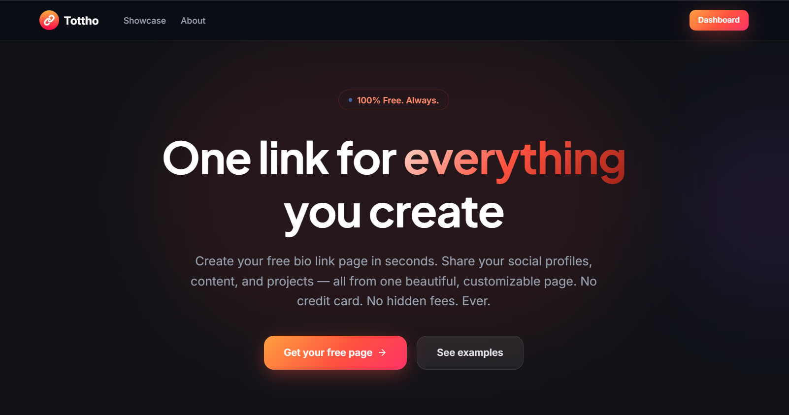

# [Tottho - Single Page Link Share Platform](https://tottho.pro.bd)

Tottho is a modern, high-performance platform built with Next.js, allowing users to create fully customizable and beautifully animated profile pages.

VISIT : [https://tottho.pro.bd](https://tottho.pro.bd)

## ✨ Features

- **20+ Customizable Themes**: A unified `LinkButton` component that seamlessly handles all theme styles and motion variants.
- **Modern Dashboard & Admin Panel**: Fully responsive, dark-mode ready dashboard built with Tailwind CSS v4 and Framer Motion for smooth UI transitions.
- **Secure Authentication**: Robust auth flow with multi-layer rate-limiting (IP-based, email-based, progressive lockouts) and Zod validation.
- **Drag & Drop Reordering**: Easily manage your links using an intuitive drag-and-drop interface powered by `@dnd-kit`.
- **Media Uploads**: Integrated with UploadThing for seamless profile picture and background image uploads.
- **Analytics**: Built-in analytics dashboard utilizing Recharts to track link clicks and profile views.
- **Stunning Visuals**: Interactive background meshes and advanced effects using Three.js and `@paper-design/shaders-react`.

## 🛠️ Tech Stack

- **Framework**: Next.js 16.2.4 (App Router)
- **UI Library**: React 19
- **Styling**: Tailwind CSS v4
- **Animations**: Framer Motion
- **Database**: MongoDB (via Mongoose)
- **Authentication**: JWT (`jose`), `bcryptjs`, custom rate-limiting middleware
- **Validation**: Zod
- **Icons**: Lucide React & React Icons
- **Uploads**: UploadThing
- **Emails**: Nodemailer

## 📁 Project Structure

- `/src/app`: Next.js App Router pages, layouts, and API routes
- `/src/components`: Reusable React UI components
- `/src/hooks`: Custom React hooks
- `/src/lib`: Utility functions and library configurations
- `/src/models`: Mongoose database schemas
- `/public`: Static assets

## 🤝 Contributing

Contributions, issues, and feature requests are welcome!

## 📝 License

This project is licensed under the MIT License.
